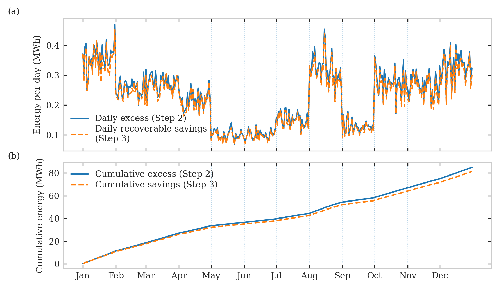
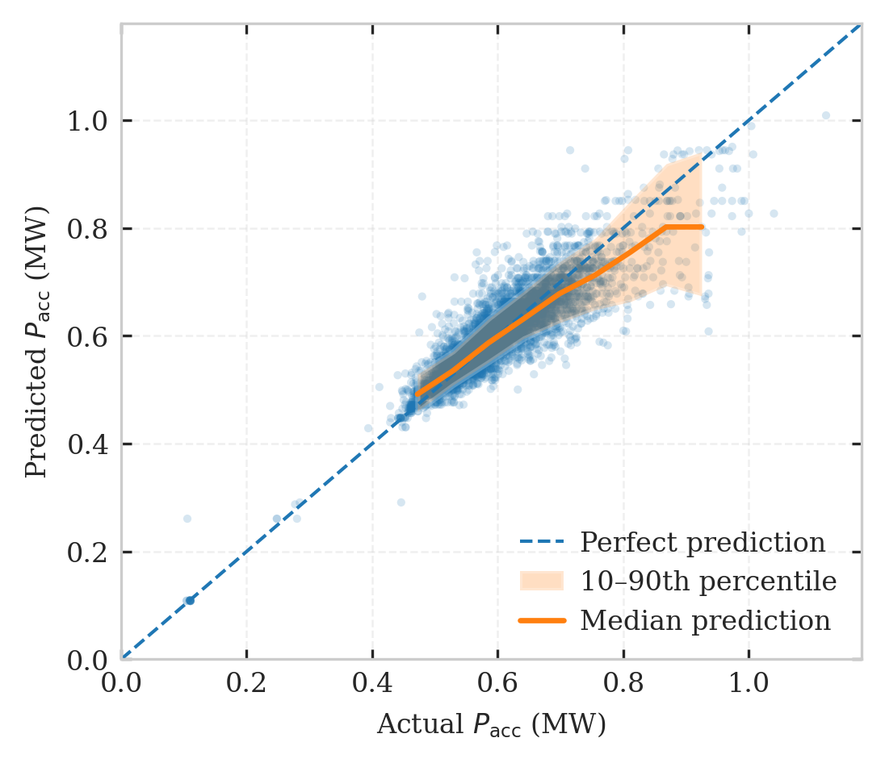
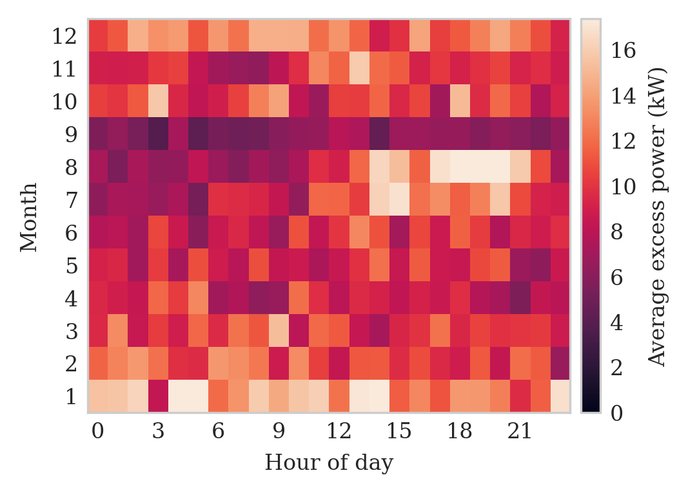
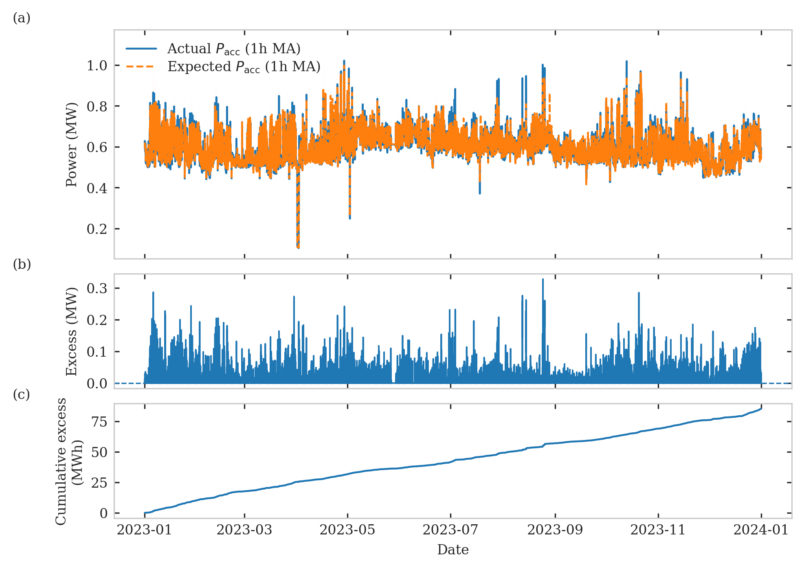
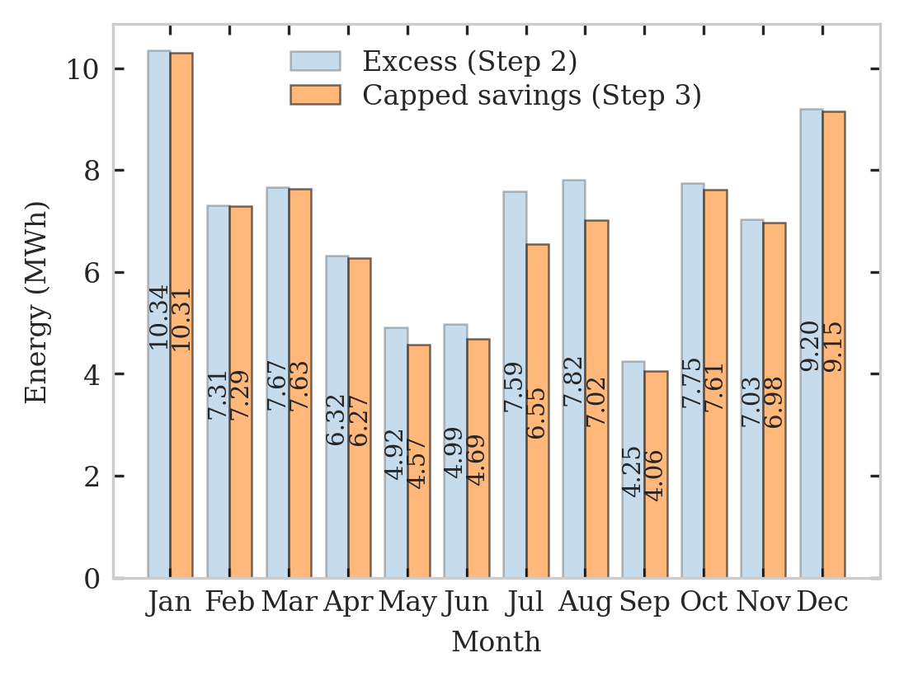

<div align="center">

# Machine Learning Guided Cooling Optimization for Data Centers

A three stage, physics guided ML pipeline that finds wasted cooling energy in an exascale supercomputer and recommends safe, small setpoint tweaks to recover it.

[](paper/ITHERM2026_paper.pdf)
[](https://arxiv.org/abs/2601.02275)
[](https://www.python.org)
[](https://lightgbm.readthedocs.io)
[](LICENSE)

</div>

---

## What this is

A reproducible study on one year of telemetry from **Frontier**, the exascale supercomputer at Oak Ridge National Laboratory. We ask a simple, operational question:

> Given a facility that already runs at near state of the art efficiency (PUE around 1.05), is there still a measurable band of cooling energy we can safely recover, and where exactly is it?

The answer turns out to be yes, and the framework here makes it auditable. We train a monotonicity constrained surrogate for facility accessory power, use the model residuals to localize excess energy in time, then replay the year with small, guardrail screened tweaks to supply temperature and per loop coolant flow.

## Headline numbers

| Quantity | Value |
| --- | --- |
| Test set MAE on accessory power | **0.026 MW** (about 4% WAPE) |
| Fraction of test points within ±0.01 of measured PUE | **98.7%** |
| Annual excess cooling energy identified | **85.2 MWh** |
| Recoverable under physics guardrails (capped by excess) | **82.1 MWh** (96.4% of excess) |
| Recoverable after strict reviewer filters | **13.4 MWh** (≈$0.8k / year) |
| Records analyzed (10 minute resolution, 2023) | **49,869** |

The 13.4 MWh number is the defensible lower bound. The 82.1 MWh number is the upper bound if all of Step 2's identified excess can be acted on. Real deployments will land somewhere in between depending on operator risk tolerance.

<div align="center">



*Daily excess (blue) vs. recoverable savings from the counterfactual policy (orange). The capped Step 3 curve stays strictly below Step 2 by construction and captures almost all of it.*

</div>

## The approach in three steps

**Step 1. Surrogate for facility accessory power.** A LightGBM regressor with monotonicity constraints on the physically sensible features (more IT load and more flow should never reduce cooling power). Inputs include per loop temperature lifts, per loop heat, a flow imbalance index, K-Means regime labels fit on (Q_tot, T_sup), and short horizon temporal context (lags and rolling means). Isotonic regression on the output corrects residual calibration bias.

**Step 2. Excess as residual.** For every 10 minute interval, compare actual accessory power to the surrogate's expected value. Positive residuals are treated as potential excess; negative residuals are not credited. Integrate to MWh and dollars under a configurable tariff. Roll up by month, hour of day, and operating regime to localize where the waste lives.

**Step 3. Counterfactual policy under guardrails.** Search a small action grid over supply temperature increases (0 to 1.5 °C in 0.2 °C steps) and per loop flow scales (no loop below 90% of baseline; dominant loop allowed slightly larger trims). Each candidate counterfactual is pushed back through the surrogate. Actions are accepted only if they satisfy explicit constraints: PUE ≥ 1, total heat removal preserved within 3%, minimum thermal lift on every loop, supply temperature cap respected. A reviewer diagnostics layer adds in distribution checks, a materiality threshold tied to the surrogate's test MAE, and simple hysteresis to avoid rapid toggling.

The whole thing is designed to be the kind of recommendation an operator could actually look at and approve.

## Repository layout

```
.
├── notebooks/
│   ├── 01_eda_frontier_dataset.ipynb                  Exploratory data analysis on the 2023 telemetry
│   └── 02_surrogate_excess_counterfactual.ipynb       Steps 1, 2, 3 end to end + reviewer diagnostics
├── paper/
│   └── ITHERM2026_paper.pdf                           Conference manuscript
├── figures/                                           All paper figures, named by content
├── data/
│   ├── Frontier HPC & Facility Data.xlsx              Raw 2023 dataset (also on figshare, see below)
│   └── README.md                                      Data dictionary and provenance
├── requirements.txt                                   Pinned versions used in the paper
├── CITATION.cff                                       For the "Cite this repository" button
├── LICENSE                                            CC BY-NC-SA 4.0
└── README.md
```

## Reproducing the results

The notebooks were developed and run on Google Colab and on a local Python 3.10 environment. Either should work.

```bash
git clone https://github.com/m-iml/ML-Optimization-Data-Centers.git
cd ML-Optimization-Data-Centers
python -m venv .venv && source .venv/bin/activate
pip install -r requirements.txt
jupyter lab
```

Then open the notebooks in order:

1. `notebooks/01_eda_frontier_dataset.ipynb` is self contained EDA. Run top to bottom.
2. `notebooks/02_surrogate_excess_counterfactual.ipynb` runs Step 1 (trains the surrogate, saves a `step1_artifacts_random/` folder), then Step 2 (excess monitoring), then Step 3 (counterfactual search), then the reviewer diagnostics block.

The dataset ships in `data/`. If you'd rather pull the canonical version, it's on figshare at [doi:10.6084/m9.figshare.24391240.v4](https://doi.org/10.6084/m9.figshare.24391240.v4) and described in [Sun et al., *Scientific Data* 11, 1077 (2024)](https://www.nature.com/articles/s41597-024-03913-w).

## Selected figures

<table>
<tr>
<td width="50%" align="center">

<br><sub>Step 1: Calibration plot. Median prediction tracks the 45° line across the operating range.</sub>
</td>
<td width="50%" align="center">

<br><sub>Step 2: Excess concentrates in winter (Jan, Dec) and an August band; smallest in May, June, Sep.</sub>
</td>
</tr>
<tr>
<td width="50%" align="center">

<br><sub>Step 2: Actual vs expected accessory power, instantaneous excess, and the cumulative MWh curve over 2023.</sub>
</td>
<td width="50%" align="center">

<br><sub>Step 3: Capped monthly savings closely shadow the Step 2 excess, confirming the policy hits real hot spots rather than inventing savings.</sub>
</td>
</tr>
</table>

## Caveats

A few things to keep in mind before extrapolating from these numbers:

- **One year, one site.** Everything here is offline counterfactual evaluation on 2023 Frontier telemetry. The surrogate would need site specific recalibration before being used elsewhere.
- **No closed loop validation yet.** Recommendations were never actually deployed on the live plant. The reviewer pass set of actions is conservative for that reason.
- **Narrow action space.** Supply temperature shifts are capped at 1.5 °C and no loop is allowed below 90% of its baseline flow. More aggressive policies might recover more energy but would need a stronger safety argument.
- **IT workload treated as exogenous.** This framework does not co optimize scheduling and cooling. That's a natural next step.
- **R² of 0.79 looks modest in isolation.** It's a consequence of the small dynamic range of accessory power (less than 1 MW span). The absolute error (MAE ≈ 0.026 MW) is what actually matters for the downstream analysis, and it is well below the savings being claimed.

## Citation

If you use the code or results here, please cite the paper:

```bibtex
@inproceedings{jadhav2026ml,
  title     = {Machine Learning Guided Cooling Optimization for Data Centers},
  author    = {Jadhav, Shrenik and Liu, Zheng},
  booktitle = {Proc. IEEE Intersociety Conference on Thermal and Thermomechanical
               Phenomena in Electronic Systems (ITHERM)},
  year      = {2026},
  note      = {arXiv:2601.02275},
  url       = {https://arxiv.org/abs/2601.02275}
}
```

## Acknowledgments

The Frontier HPC & Facility Data workbook is courtesy of Grant et al. and the Oak Ridge Leadership Computing Facility. Their open release of high resolution operational telemetry is what made this work possible. Frontier is a U.S. Department of Energy Office of Science user facility operated by Oak Ridge National Laboratory.

## Authors

- **Shrenik Jadhav**, Department of Computer and Information Science, University of Michigan-Dearborn ([ORCID](https://orcid.org/0009-0003-6906-7465))
- **Zheng Liu**, Department of Industrial and Manufacturing Systems Engineering, University of Michigan-Dearborn ([ORCID](https://orcid.org/0000-0003-4869-8893))

Questions, bug reports, and PRs are all welcome. Open an issue or reach out directly.

## License

Code and notebooks are released under the CC BY-NC-SA 4.0. The Frontier HPC & Facility Data is redistributed under the same CC license used by the original figshare deposit; see [`data/README.md`](data/README.md) for details.
